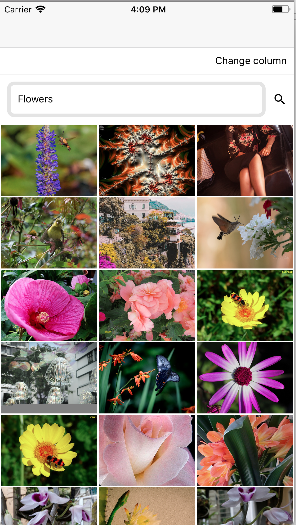

# react-native Image gridview 

This component (uses react-native 0.56) allows to display a grid/collection of images with more than one item per row. The items per row can be 2, 3 or 4. The items per row is configurable and it uses a 'FlatList' in order to have a proper recycle mechanism.

# Getting started
 - npm install
 - react-native link
 - npm start

# Run in Android
 - react-native run-android

# Run in iOS
 - react-native run-ios

# Code structure
 - Uses redux architecture.

# API
 - Uses Flickr API to fetch results of search.

# Home Component
 - Home screens defines menu, search field and grid list to display list of images.
 - User can scroll to bottom to load more images. [Pagination]

# ImageDetail Component
 - Full screen image component.

# GridLayout component
 - Grid layout shows list of images in grid.
 - Grid column can be of 2, 3 or 4.

# DataSearch Component
 - Data search component contains TextInput where user can enter any keyword.
 - User can search the result either by pressing search icon or done from keyboard.

# Menus
 - Menu to change column number for different options of list.
 - react-native-popup-menu is used to display menu options.

# Image caching
 - Image caching is achieved by react-native-img-cache
 - react-native-img-cache requires react-native-fetch-blob

# API caching
 - API caching is achieved by persisting the reducer by whitlisting it.

# Tradeoffs
 - Currently, this component does not supoort RequestInterceptor and ResponseInterceptor for API layer.
 - Network layer can be improved more using APIRequest.

